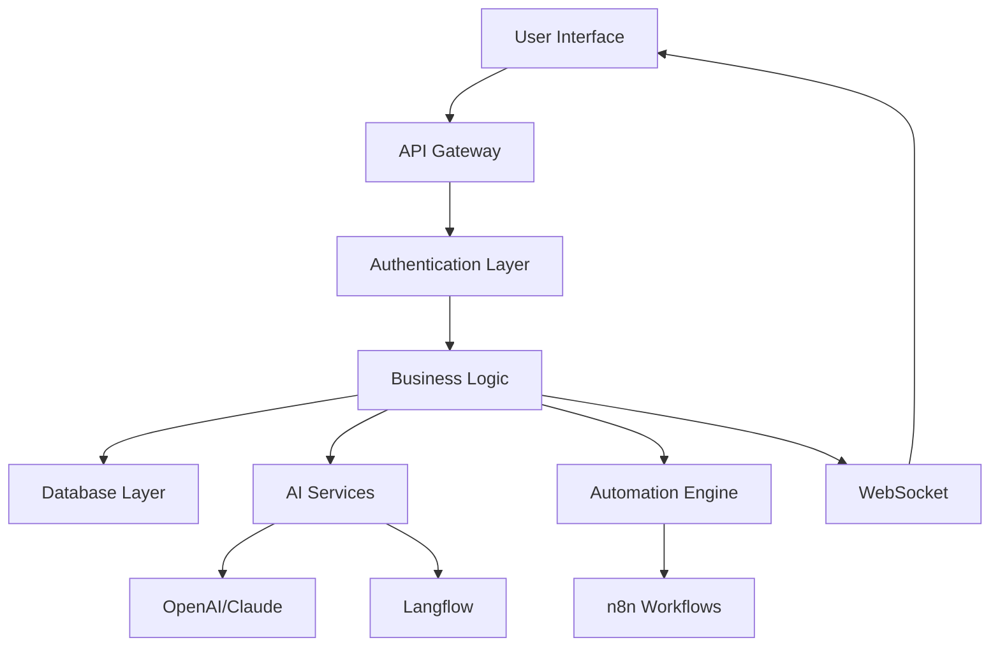

# 🏗️ Zyra Architecture Documentation

## System Overview

Zyra is built as a modern, scalable AI automation platform with a microservices-oriented architecture. The system is designed to handle high-throughput data processing, real-time automation workflows, and AI-powered insights.

## 🎯 Core Components

### 1. Frontend Layer (Next.js 14)
- **Purpose**: User interface and experience
- **Technology**: React 18, TypeScript, Tailwind CSS
- **Features**: 
  - Server-side rendering (SSR)
  - Static site generation (SSG)
  - Real-time updates via WebSocket
  - Responsive design with futuristic UI

### 2. API Gateway (Express.js)
- **Purpose**: Request routing, authentication, rate limiting
- **Technology**: Node.js, Express.js
- **Features**:
  - JWT authentication
  - Role-based access control
  - Rate limiting and throttling
  - Request/response logging
  - CORS management

### 3. Business Logic Layer
- **Purpose**: Core application logic and data processing
- **Components**:
  - User management
  - Automation orchestration
  - Data processing pipeline
  - AI integration services

### 4. Data Layer (PostgreSQL)
- **Purpose**: Persistent data storage
- **Technology**: PostgreSQL 14+
- **Features**:
  - ACID compliance
  - JSONB support for flexible schemas
  - Full-text search
  - Connection pooling

### 5. AI Services Layer
- **Purpose**: AI processing and insights
- **Components**:
  - OpenAI GPT-4 integration
  - Claude AI integration
  - Langflow pipeline management
  - Custom AI model endpoints

### 6. Automation Engine (n8n)
- **Purpose**: Workflow automation and orchestration
- **Technology**: n8n workflow engine
- **Features**:
  - Visual workflow builder
  - Node-based automation
  - Webhook triggers
  - API integrations

## 🔄 Data Flow Architecture



## 🗄️ Database Schema

### Core Tables

#### Users Table
```sql
CREATE TABLE users (
    id UUID PRIMARY KEY DEFAULT gen_random_uuid(),
    email VARCHAR UNIQUE NOT NULL,
    password_hash VARCHAR NOT NULL,
    first_name VARCHAR NOT NULL,
    last_name VARCHAR NOT NULL,
    role VARCHAR DEFAULT 'user',
    is_active BOOLEAN DEFAULT true,
    is_verified BOOLEAN DEFAULT false,
    preferences JSONB DEFAULT '{}',
    metadata JSONB DEFAULT '{}',
    created_at TIMESTAMP DEFAULT NOW(),
    updated_at TIMESTAMP DEFAULT NOW()
);
```

#### Automations Table
```sql
CREATE TABLE automations (
    id UUID PRIMARY KEY DEFAULT gen_random_uuid(),
    user_id UUID REFERENCES users(id) ON DELETE CASCADE,
    name VARCHAR NOT NULL,
    description TEXT,
    status VARCHAR DEFAULT 'draft',
    workflow_config JSONB NOT NULL,
    trigger_config JSONB,
    ai_config JSONB,
    execution_count INTEGER DEFAULT 0,
    success_count INTEGER DEFAULT 0,
    error_count INTEGER DEFAULT 0,
    last_executed TIMESTAMP,
    next_execution TIMESTAMP,
    metadata JSONB DEFAULT '{}',
    created_at TIMESTAMP DEFAULT NOW(),
    updated_at TIMESTAMP DEFAULT NOW()
);
```

#### Data Sources Table
```sql
CREATE TABLE data_sources (
    id UUID PRIMARY KEY DEFAULT gen_random_uuid(),
    user_id UUID REFERENCES users(id) ON DELETE CASCADE,
    name VARCHAR NOT NULL,
    type VARCHAR NOT NULL,
    status VARCHAR DEFAULT 'processing',
    file_path VARCHAR,
    file_name VARCHAR,
    file_size INTEGER,
    mime_type VARCHAR,
    schema JSONB,
    preview_data JSONB,
    row_count INTEGER,
    processing_config JSONB,
    metadata JSONB DEFAULT '{}',
    created_at TIMESTAMP DEFAULT NOW(),
    updated_at TIMESTAMP DEFAULT NOW()
);
```

#### AI Insights Table
```sql
CREATE TABLE ai_insights (
    id UUID PRIMARY KEY DEFAULT gen_random_uuid(),
    user_id UUID REFERENCES users(id) ON DELETE CASCADE,
    data_source_id UUID REFERENCES data_sources(id) ON DELETE CASCADE,
    type VARCHAR NOT NULL,
    title VARCHAR NOT NULL,
    description TEXT NOT NULL,
    insight_data JSONB NOT NULL,
    ai_model_info JSONB,
    status VARCHAR DEFAULT 'generating',
    confidence_score DECIMAL(3,2),
    tags JSONB,
    is_favorite BOOLEAN DEFAULT false,
    generated_at TIMESTAMP,
    metadata JSONB DEFAULT '{}',
    created_at TIMESTAMP DEFAULT NOW(),
    updated_at TIMESTAMP DEFAULT NOW()
);
```

## 🔐 Security Architecture

### Authentication Flow
1. User submits credentials
2. Server validates credentials against database
3. JWT token generated with user info and expiration
4. Token stored in secure HTTP-only cookie
5. Subsequent requests include token in Authorization header
6. Middleware validates token and extracts user info

### Authorization Levels
- **User**: Basic access to own data and automations
- **Admin**: Access to all users and system management
- **Super Admin**: Full system access and configuration

### Security Measures
- Password hashing with bcrypt (12 rounds)
- JWT token expiration and refresh
- Rate limiting per IP and user
- Input validation and sanitization
- SQL injection prevention
- CORS configuration
- Helmet security headers

## 🚀 Performance Optimization

### Database Optimization
- Connection pooling (min: 2, max: 10)
- Indexed columns for fast queries
- JSONB for flexible schema storage
- Query optimization with EXPLAIN ANALYZE

### Caching Strategy
- Redis for session storage
- In-memory caching for frequently accessed data
- CDN for static assets
- Browser caching with appropriate headers

### Real-time Updates
- WebSocket connections for live updates
- Event-driven architecture
- Efficient message broadcasting
- Connection management and cleanup

## 🔄 Integration Architecture

### AI Services Integration
```javascript
// OpenAI Integration
const openai = new OpenAI({
  apiKey: process.env.OPENAI_API_KEY
});

// Claude Integration
const anthropic = new Anthropic({
  apiKey: process.env.ANTHROPIC_API_KEY
});

// Langflow Integration
const langflowClient = new LangflowClient({
  baseURL: process.env.LANGFLOW_API_URL,
  apiKey: process.env.LANGFLOW_API_KEY
});
```

### n8n Integration
```javascript
// n8n Workflow Management
const n8nClient = new N8nClient({
  baseURL: process.env.N8N_API_URL,
  apiKey: process.env.N8N_API_KEY
});
```

## 📊 Monitoring & Logging

### Logging Strategy
- **Winston** for structured logging
- **Log levels**: error, warn, info, debug
- **Log files**: error.log, combined.log, exceptions.log
- **Console output** for development

### Monitoring Metrics
- API response times
- Database query performance
- Memory usage
- CPU utilization
- Error rates
- User activity metrics

### Health Checks
- Database connectivity
- External service availability
- System resource usage
- API endpoint health

## 🚀 Deployment Architecture

### Development Environment
- Local PostgreSQL database
- Docker containers for services
- Hot reloading for development
- Environment-specific configurations

### Production Environment
- **Frontend**: Vercel deployment
- **Backend**: Render/Railway deployment
- **Database**: Supabase/Neon.tech
- **CDN**: Vercel Edge Network
- **Monitoring**: Built-in logging and metrics

### Scaling Strategy
- Horizontal scaling for API servers
- Database read replicas
- Load balancing
- Microservices separation
- Container orchestration (Docker/Kubernetes)

## 🔧 Development Workflow

### Code Organization
```
src/
├── controllers/     # Request handlers
├── services/        # Business logic
├── models/          # Data models
├── middleware/       # Custom middleware
├── routes/          # API routes
├── utils/           # Utility functions
└── config/          # Configuration
```

### Testing Strategy
- Unit tests for business logic
- Integration tests for API endpoints
- End-to-end tests for user workflows
- Performance testing for scalability

### CI/CD Pipeline
1. Code commit to repository
2. Automated testing
3. Code quality checks
4. Security scanning
5. Build and deployment
6. Health checks

## 📈 Future Enhancements

### Planned Features
- Multi-tenant architecture
- Advanced AI model training
- Custom workflow templates
- Enterprise SSO integration
- Advanced analytics dashboard
- Mobile application
- API rate limiting per user
- Advanced caching strategies

### Scalability Improvements
- Microservices architecture
- Event-driven communication
- Message queue implementation
- Database sharding
- CDN optimization
- Global deployment

---

This architecture provides a solid foundation for Zyra's growth and ensures scalability, maintainability, and performance as the platform evolves.

